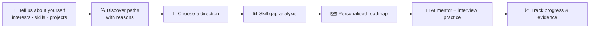

<div align="center">

# 🧭 PathFinder AI

### Your career is not a job title. It's a path.

**Tell us what you know. Tell us what you enjoy. We'll help you discover where you could go next.**


**[🌐 Live Demo](https://YOUR-APP.vercel.app)** · **[📖 API Docs](https://YOUR-BACKEND.onrender.com/api/v1/docs)** · Click **"Try the demo profile"** — no sign-up needed

</div>

---

## 💡 What is PathFinder AI?

Most career tools assume you already know what you want to be.
**PathFinder AI starts from you instead** — your interests, skills, projects and certificates — and helps you:

1. **Discover** several career paths that fit you, each with a clear *"why it appeared"*
2. **Explore & compare** 56 careers side by side
3. **See your skill gaps** for the career you choose
4. **Follow a personalised roadmap** that skips what you already know
5. **Get help** from an AI mentor and practise with an AI interviewer

> It never claims one career is "the best", never guarantees jobs, and always shows the evidence behind every recommendation.

---

## 🧭 How it works



---

## 🖥️ What you'll see in the app

| Screen | What it does |
|---|---|
| **Onboarding** | 7 quick steps — interests, technologies (with levels or *"I'm not sure"*), activities, work style, background, certificates, projects |
| **Career Profile** | Interest bars (*"based on your stated interests"*), strengths and work preferences |
| **Discover** | Several career paths, each with *why it appeared* and what you'd want to build next |
| **Career Explorer** | 56 careers: responsibilities, skills, entry routes, related careers, plus an interactive knowledge graph |
| **Compare** | Up to 4 careers side by side |
| **Skill Gap** | Each skill marked **Strong / Developing / Needs development / Not yet explored**, with what to learn |
| **Roadmap** | Phases → steps (Learn → Practice → Build → Prove); adapts to your hours and what you already know |
| **Projects & Certificates** | Beginner → advanced projects built around your gaps; honest advice on which certificates are worth it |
| **AI Mentor** | Streaming chat that can explain skills, quiz you and adjust your roadmap (`Ctrl + K`) |
| **Interview Mode** | Technical, behavioural, SQL and system-design practice with feedback and follow-up questions |
| **Job Market** | Skills that appear most often in job descriptions, with the data source and time period always shown |
| **Progress** | Completion, an evidence log, and readiness shown as evidence rather than a fake "% job-ready" |

---

## 🛠️ Tech stack

| Layer | Tools |
|---|---|
| **Frontend** | Next.js 15, TypeScript, Tailwind CSS, Framer Motion, React Query, React Flow |
| **Backend** | Python, FastAPI, Pydantic, SQLAlchemy, PostgreSQL |
| **AI** | LangGraph (8-agent pipeline), LangChain, Gemini / OpenAI (optional) |
| **Search (RAG)** | Qdrant + BM25 + Reciprocal Rank Fusion + reranking |
| **Knowledge graph** | Neo4j |
| **Background jobs** | Redis + Celery |
| **Deployment** | Docker, Docker Compose, Vercel, Render |

---

## ⚡ Quick start

```bash
# Backend
cd backend
python -m venv .venv
.venv\Scripts\activate          # Mac/Linux: source .venv/bin/activate
pip install -r requirements-dev.txt
uvicorn app.main:app --reload --port 8000

# Frontend (new terminal)
cd frontend
npm install
npm run dev                     # open http://localhost:3000
```

Runs **fully free and offline** — no API key needed. Add a free Gemini key in `.env` for AI-written explanations.

---
