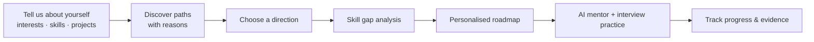
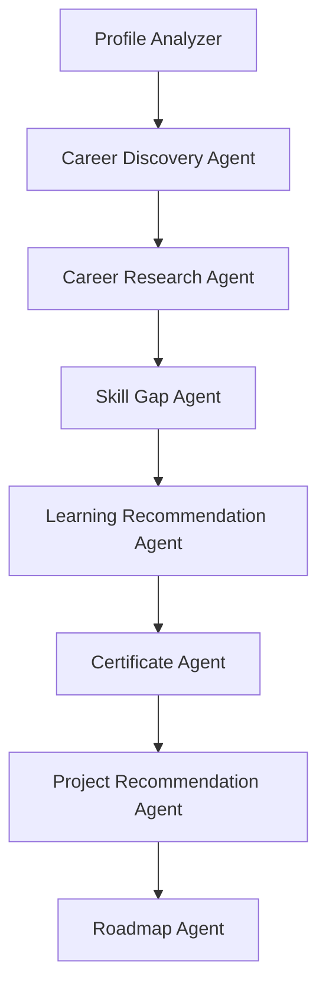

<div align="center">

# 🧭 PathFinder AI

### Your career is not a job title. It's a path.

**Tell us what you know. Tell us what you enjoy. We'll help you discover where you could go next.**


</div>

---

## 💡 What is PathFinder AI?

Most career tools assume you already know what you want to be.
**PathFinder AI starts from you instead** — your interests, skills, projects and certificates — and helps you:

1. **Discover** several career paths that fit you, each with a clear *"why it appeared"*
2. **Explore & compare** 56 careers side by side
3. **See your skill gaps** for the career you choose
4. **Follow a personalised roadmap** that skips what you already know
5. **Get help** from an AI mentor and practise with an AI interviewer

> It never claims one career is "the best", never guarantees jobs, and always shows the evidence behind every recommendation.

---

## 🧭 How it works



---

## 🖥️ Features

| Screen | What it does |
|---|---|
| **Onboarding** | 7 quick steps — interests, technologies (with levels or *"I'm not sure"*), activities, work style, background, certificates, projects |
| **Career Profile** | Interest bars based on what you told us, plus strengths and work preferences |
| **Discover** | Several career paths, each with *why it appeared* and what you'd want to build next |
| **Career Explorer** | 56 careers with responsibilities, skills, entry routes, related careers and an interactive knowledge graph |
| **Compare** | Up to 4 careers side by side |
| **Skill Gap** | Each skill marked **Strong / Developing / Needs development / Not yet explored**, with what to learn |
| **Roadmap** | Phases → steps (Learn → Practice → Build → Prove); adapts to your weekly hours and what you already know |
| **Projects** | Beginner → advanced projects chosen to close your specific gaps |
| **Certificates** | Honest advice on which certificates are worth it — and when a project is better |
| **AI Mentor** | Streaming chat that explains skills, quizzes you and adjusts your roadmap (`Ctrl + K`) |
| **Interview Mode** | Technical, behavioural, SQL and system-design practice with feedback and follow-up questions |
| **Job Market** | The skills that appear most often in job descriptions, always showing the data source and time period |
| **Progress** | Completion, an evidence log, and readiness shown as evidence rather than a fake "% job-ready" |

A built-in **demo profile** lets anyone explore the app without signing up — click **"Try the demo profile"** on the home page.

---

## 🛠️ Tech stack

| Layer | Tools |
|---|---|
| **Frontend** | Next.js 15, TypeScript, Tailwind CSS, Framer Motion, React Query, React Flow |
| **Backend** | Python, FastAPI, Pydantic, SQLAlchemy |
| **Database** | SQLite (local) or PostgreSQL |
| **AI** | LangGraph (8-agent pipeline), LangChain, Google Gemini (free tier, optional) |
| **Search (RAG)** | Qdrant + BM25 + Reciprocal Rank Fusion + reranking |
| **Knowledge graph** | Neo4j (in-memory fallback included) |
| **Background jobs** | Redis + Celery (optional) |
| **Deployment** | Docker, Docker Compose |

---

## 🤖 How the AI works



- Every agent runs **rule-based logic first**, so results are consistent and testable.
- When a Gemini key is added, the AI only **writes the explanations** — every result is checked before it's saved.
- Search combines **meaning-based search (Qdrant)** with **keyword search (BM25)**, then merges and reranks the results.
- The whole app works **without any API key**.

---

## ⚡ Run it locally (VS Code)

**Requirements:** Python 3.11+ and Node.js 20+

**Terminal 1 — backend**
```bash
cd backend
python -m venv .venv
.venv\Scripts\activate          # Mac/Linux: source .venv/bin/activate
pip install -r requirements-dev.txt
uvicorn app.main:app --reload --port 8000
```

**Terminal 2 — frontend**
```bash
cd frontend
npm install
npm run dev
```

Open **http://localhost:3000** and click **"Try the demo profile"**.

---

## 🔑 Optional: free AI with Gemini

1. Get a free key at https://aistudio.google.com/apikey
2. Copy `.env.example` to `.env` and set:
   ```
   LLM_PROVIDER=gemini
   GEMINI_API_KEY=your-key
   GEMINI_MODEL=gemini-3.8-flash
   EMBEDDING_PROVIDER=hash
   ```
3. Restart the backend.

Never upload your `.env` file — it's already excluded by `.gitignore`.

---

## 🐳 Run with Docker (full stack)

```bash
docker compose up --build
```
Starts PostgreSQL, Redis, Qdrant, Neo4j, the API, a background worker and the website at http://localhost:3000.

---

## ✅ Testing

```bash
cd backend
python -m pytest
```
**56 tests** cover career matching, skill gaps, roadmap generation, recommendations, the AI pipeline, the full user journey, privacy between users and file-upload security.

AI quality checks on sample user profiles:

| Check | Result |
|---|---|
| A relevant career appears in the top 3 | 100% |
| Recommendations that reference anything outside the knowledge base | 0% |
| Search finds the correct source | 100% |

---

## 📁 Project structure

```
pathfinder-ai/
├── backend/
│   ├── app/          # FastAPI app: API, AI agents, engines, RAG, graph
│   ├── data/         # Careers, skills, certificates, projects, interview questions (YAML)
│   └── tests/        # Unit, integration and AI evaluation tests
├── frontend/         # Next.js website
├── docker-compose.yml
└── .env.example
```

Adding a new career needs **no code changes** — just add it to `backend/data/careers/`.

---

## 🔮 Future improvements

- Database migrations with Alembic
- Real job-board data connectors
- Auto-graded coding and SQL exercises
- Multi-language support

---

<div align="center">

Built by **Lakshay** · BCA, Chitkara University

</div>
