# PathFinder AI

**Your career is not a job title. It's a path.**

PathFinder AI is a personalised career discovery and development platform. You don't need to know which career you want: you tell it what you know, what you enjoy and what you've built. It suggests several directions (and says why each one appeared), helps you explore and compare them, measures your skill gaps against the one you choose, and then builds an adaptive roadmap. An AI mentor and interview coach support you along the way.

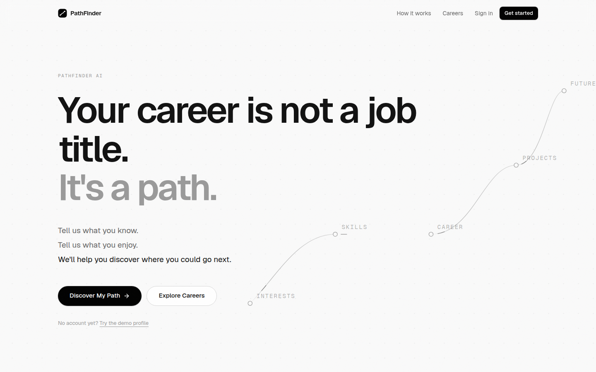

---

## Contents

1. [Problem](#problem) · [Solution](#solution)
2. [Screenshots](#screenshots)
3. [Features](#features)
4. [Architecture](#architecture)
5. [AI architecture (LangGraph)](#ai-architecture-langgraph)
6. [Recommendation engine](#recommendation-engine)
7. [Career knowledge graph](#career-knowledge-graph)
8. [RAG pipeline](#rag-pipeline)
9. [Database design](#database-design)
10. [API documentation](#api-documentation)
11. [Setup](#setup) · [Environment variables](#environment-variables) · [Docker](#docker)
12. [Testing](#testing) · [Evaluation](#evaluation)
13. [Product principles](#product-principles)
14. [Future improvements](#future-improvements)

---

## Problem

Career tools usually fall into one of two camps:

- **Resume analyzers** assume you already know your target role.
- **Generic chatbots** give confident advice that isn't grounded in who you are or what the role really needs.

Students and career-switchers need something else. They need to see which options fit what they already know and enjoy, get an honest picture of the gap to each option, and follow a practical plan that changes as their life does.

## Solution

PathFinder combines five things:

| Layer | What it does |
|---|---|
| **Career discovery** | Several relevant paths, each with the evidence behind it: your skills, interests, activities, projects |
| **Skill graph** | 100-skill taxonomy + career knowledge graph (Neo4j): requirements, prerequisites, technologies, certificates, projects |
| **Gap analysis** | Your level vs. the target level for every required skill, with why it matters, what to learn, practice, a project and an optional certificate |
| **Adaptive roadmap** | Built only from what you still need. It skips what you know, inserts missing prerequisites, re-times itself to your hours and carries completed work over when you switch careers |
| **AI mentor + interview coach** | Streamed, cited answers grounded in your profile and roadmap. The mentor can adjust your plan and quiz you, and a passed quiz is saved as evidence |

**Everything runs without an API key.** Every AI feature has a deterministic engine underneath. An LLM (OpenAI or Gemini) adds richer language, but it can only *select and explain*. It never writes to the database directly.

---

## Screenshots

| | |
|---|---|
| 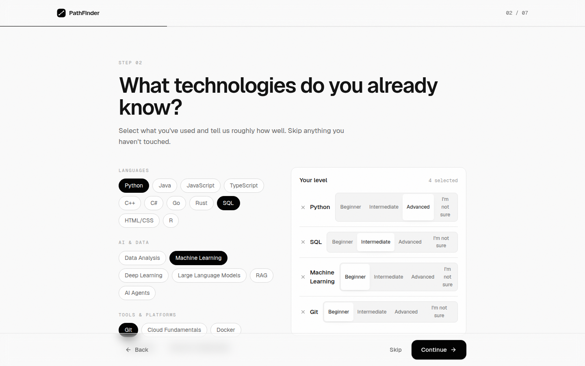 Conversational onboarding (07 steps) | 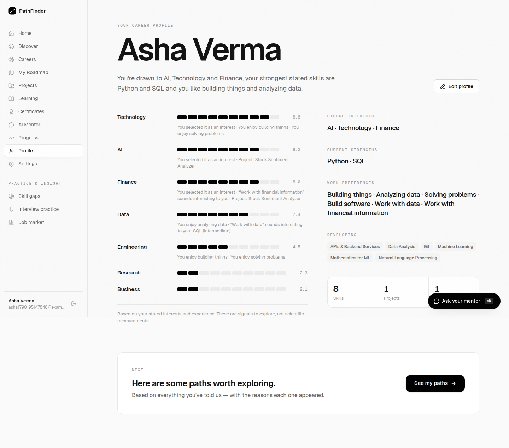 Career profile |
| 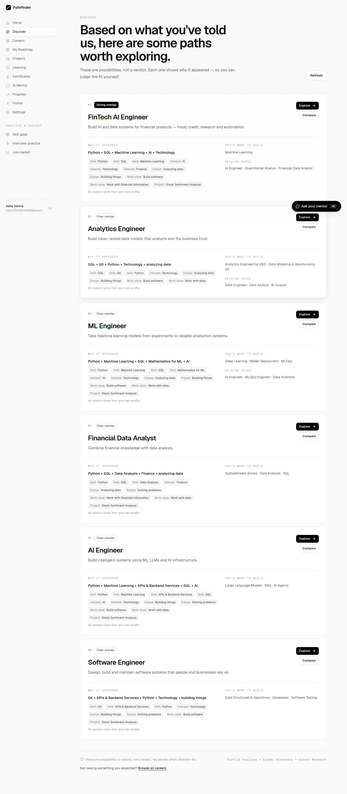 Career discovery — *why it appeared* | 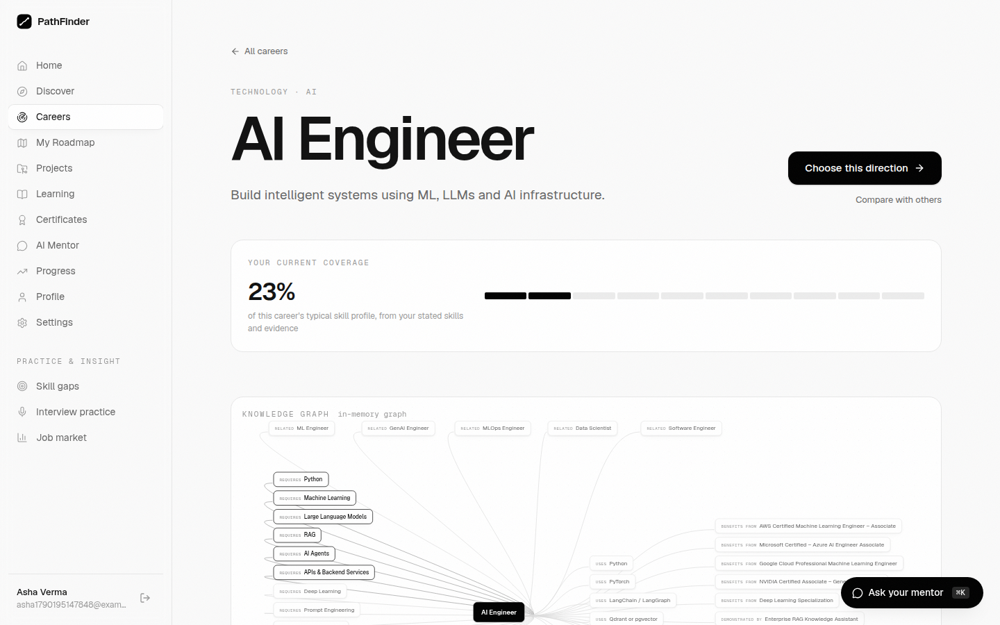 Career detail + knowledge graph |
| 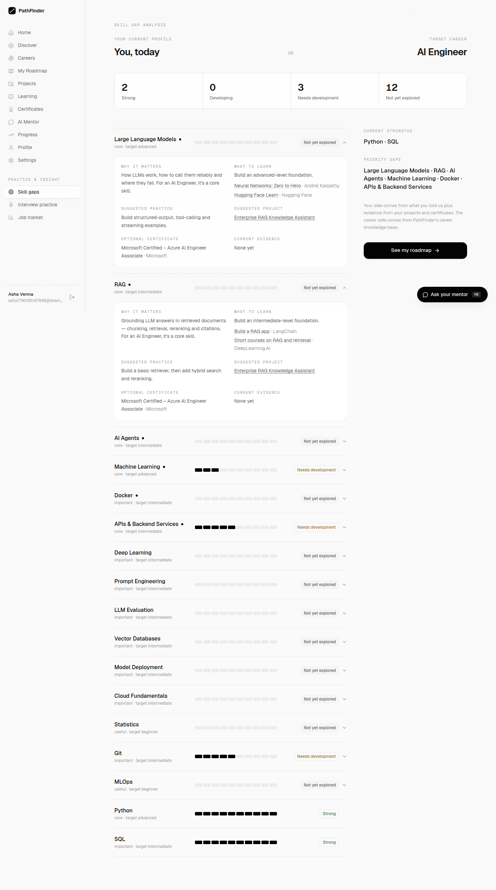 Skill gap analysis | 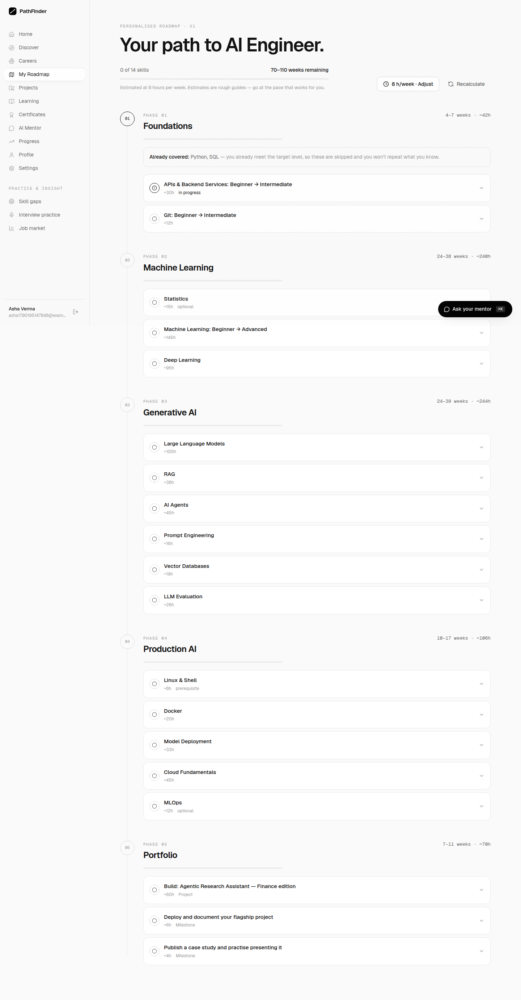 Personalised roadmap |
| 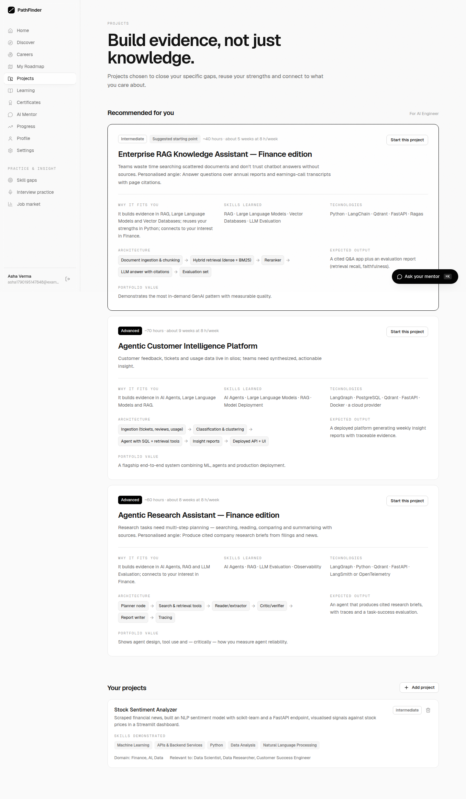 Project recommendations | 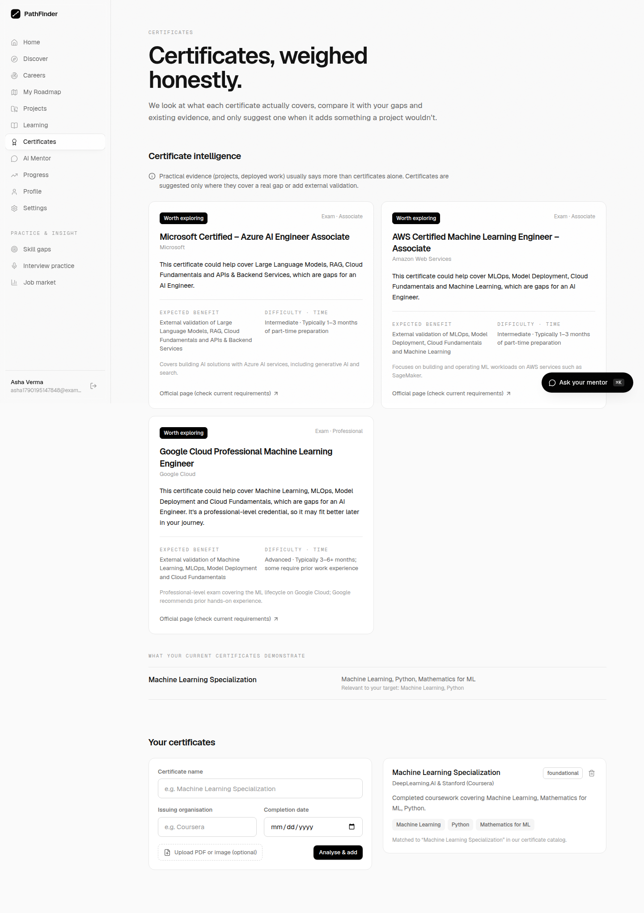 Certificate intelligence |
| 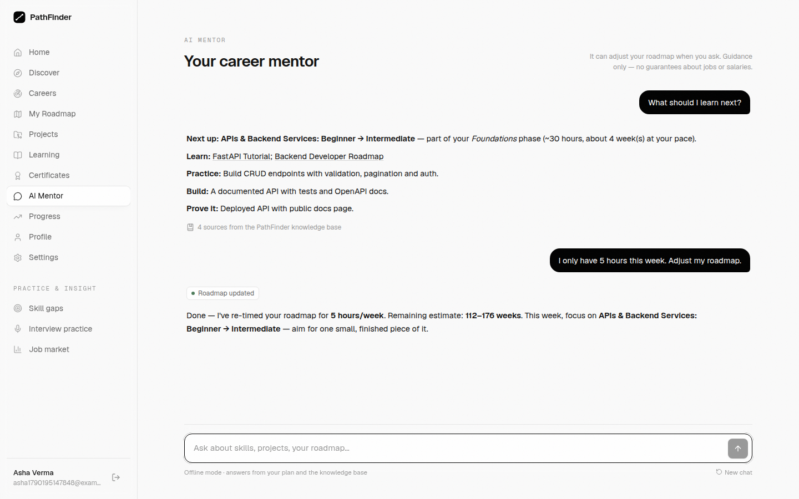 AI mentor adjusting the roadmap | 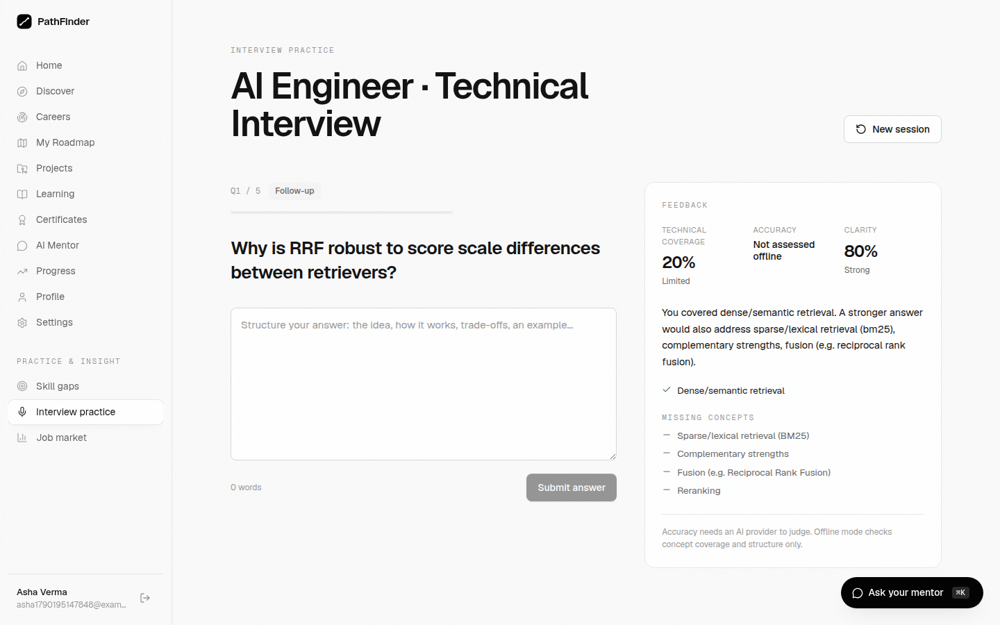 Interview mode |
| 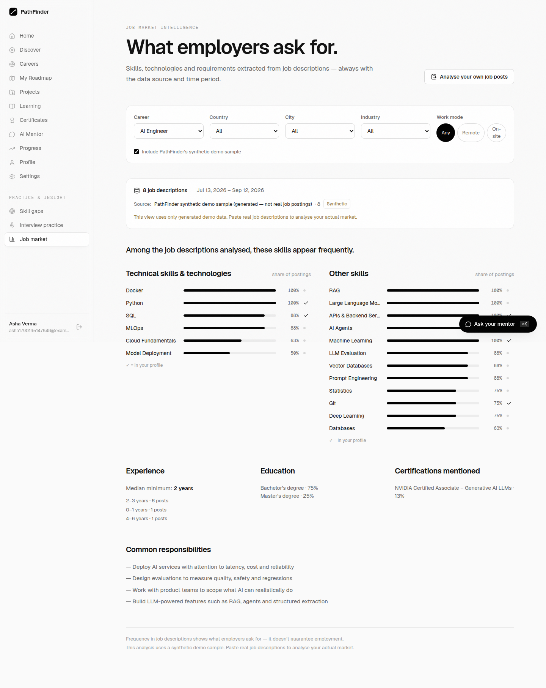 Job-market intelligence | 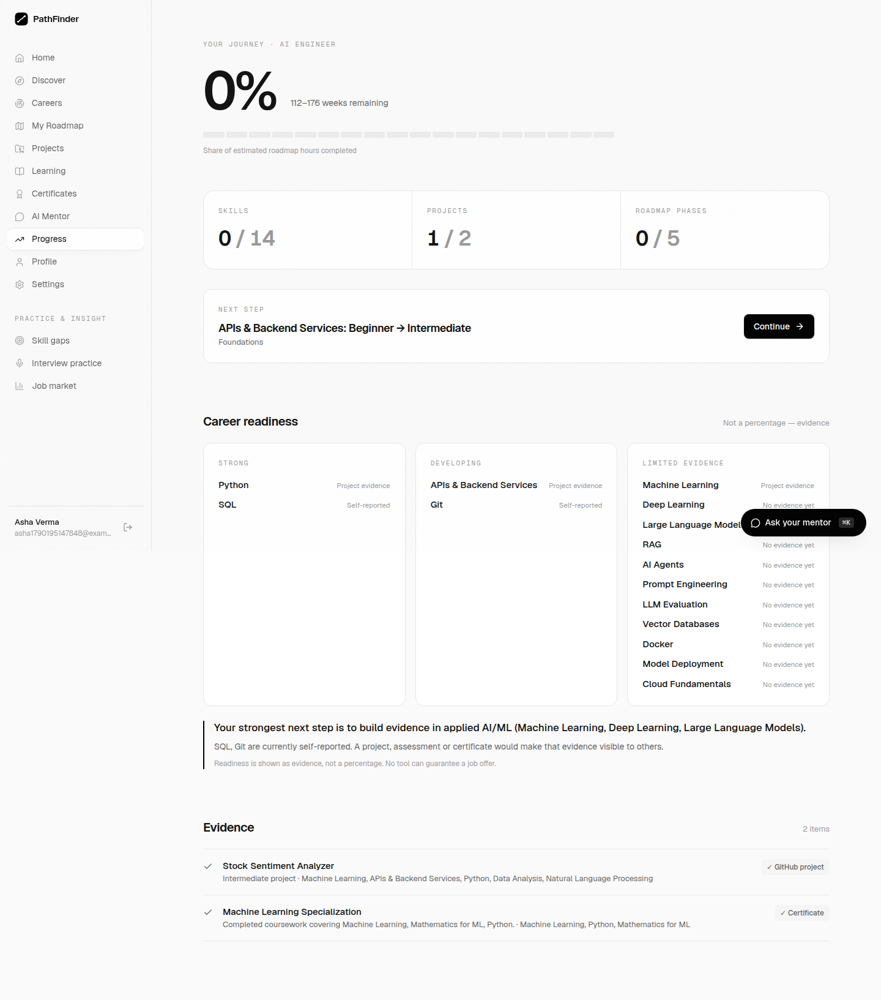 Progress + evidence-based readiness |
| 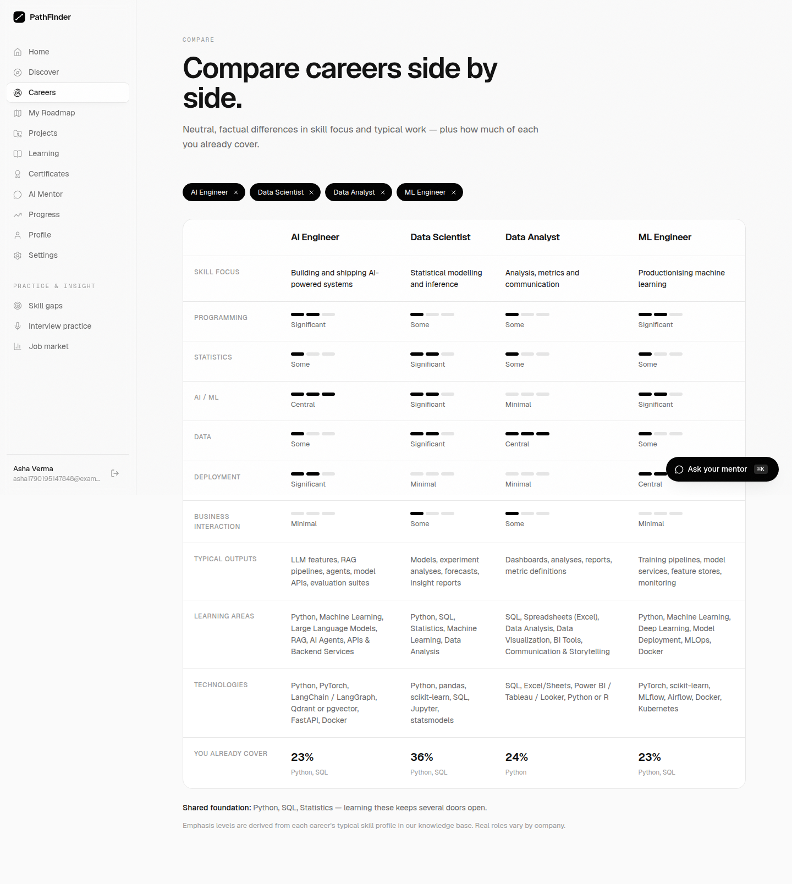 Career comparison | 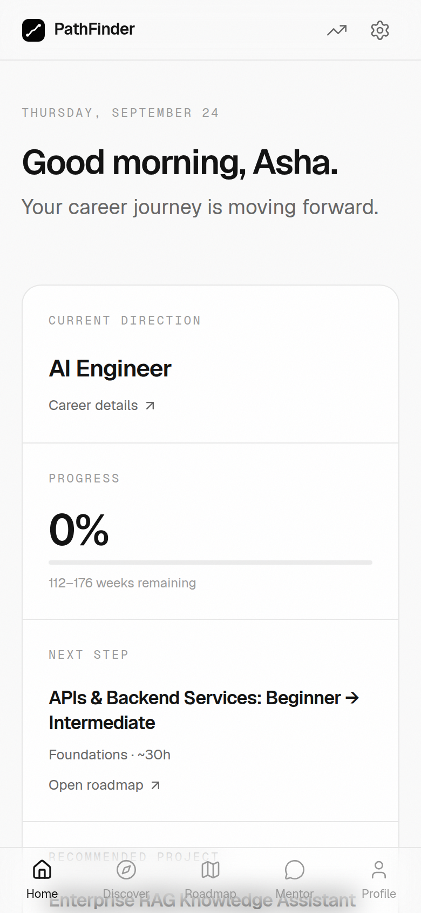 Mobile |

All 30 screenshots are in [`docs/screenshots`](docs/screenshots). They were captured from a real end-to-end browser run: signup → onboarding → discovery → selection → roadmap → mentor.

---

## Features

**Discovery & exploration**
- Seven-step, full-screen onboarding: interests, technologies with levels (including *"I'm not sure"*), activities, work styles, background, certificates (with PDF/image upload and analysis) and projects (with skill extraction). Every step can be skipped.
- Career profile: domain affinity bars labelled *"Based on your stated interests and experience"*, plus strengths, interests and work preferences.
- Career discovery: several diverse paths, each with *why it appeared*, what you'd want to build next and related paths.
- Career explorer: **56 careers** across 18 categories. Each detail page covers what they do, responsibilities, core skills (with your level), technologies, entry routes, example projects, typical learning path, related careers, who might enjoy the work and questions to explore first.
- Side-by-side comparison of up to 4 careers, derived neutrally from each skill profile.

**Planning**
- Gap analysis: *Strong / Developing / Needs development / Not yet explored*, with explanations.
- Adaptive roadmap: phases → steps, with Learn → Practice → Build → Prove for every item. Changes in hours, "I already know X", step completion and career switches all take effect immediately.
- Certificate intelligence: e.g. *"This certificate could help cover X, but your current profile already demonstrates Y, so a project may provide stronger additional evidence."*
- Project recommendations: beginner → advanced ladder, personalised by gaps, strengths and domain (e.g. *"Finance edition"*). Each includes the problem, why it fits you, architecture, expected output and portfolio value.

**Support**
- AI mentor (⌘K anywhere): streamed via SSE. It uses tools (next step, explain, project, review, quiz, readiness, adjust hours, mark known, switch career) and cites the knowledge base.
- Interview mode: technical, behavioural, case study, system design, SQL, coding and domain questions. Answers are scored on technical coverage, accuracy, clarity and missing concepts, followed by a follow-up question.
- Job-market intelligence: filter by country, city, remote, industry and career. The data source, sample size and time period are always shown. You can paste your own job descriptions, and they stay private to you.
- Progress: overall %, skills, projects, phases, an evidence log (✓ skill, project, certificate, assessment, quiz, artifact) and **evidence-based readiness** instead of a "job-ready %".

**Platform**
- JWT (httpOnly cookie + bearer), optional Google OAuth, and per-user data isolation on every query.
- Secure uploads (magic-byte sniffing, size limits, random names, Fernet encryption at rest). Mentor messages are encrypted at rest.
- Export and delete-account endpoints, rate limiting, consistent error envelopes (no stack traces) and security headers.
- Redis caching, Celery background jobs, streaming AI responses, pagination and indexes.

---

## Architecture

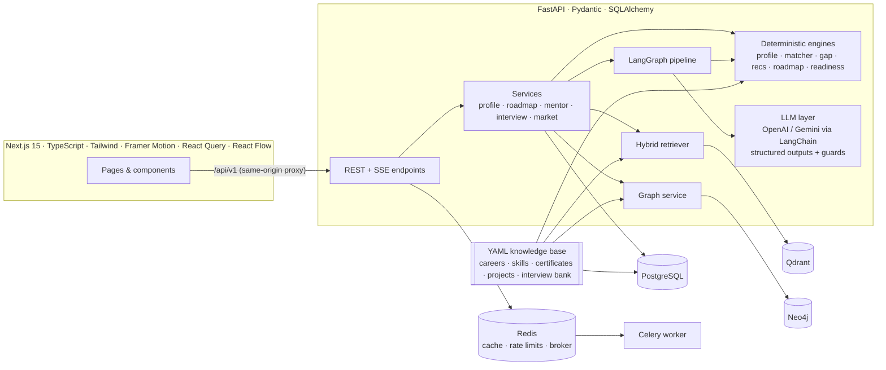
```mermaid
flowchart LR
  subgraph Client["Next.js 15 · TypeScript · Tailwind · Framer Motion · React Query · React Flow"]
    UI[Pages & components]
  end
  UI -- "/api/v1 (same-origin proxy)" --> API

  subgraph Backend["FastAPI · Pydantic · SQLAlchemy"]
    API[REST + SSE endpoints] --> SVC[Services<br/>profile · roadmap · mentor · interview · market]
    SVC --> ENG[Deterministic engines<br/>profile · matcher · gap · recs · roadmap · readiness]
    SVC --> LG[LangGraph pipeline]
    LG --> ENG
    LG --> LLM[LLM layer<br/>OpenAI / Gemini via LangChain<br/>structured outputs + guards]
    SVC --> RAG[Hybrid retriever]
    SVC --> KG[Graph service]
  end

  SVC --> PG[(PostgreSQL)]
  API --> RD[(Redis<br/>cache · rate limits · broker)]
  RD --> WK[Celery worker]
  RAG --> QD[(Qdrant)]
  KG --> NJ[(Neo4j)]
  KB[[YAML knowledge base<br/>careers · skills · certificates · projects · interview bank]] --> ENG
  KB --> RAG
  KB --> KG
  KB --> PG
```

**Graceful degradation.** Each dependency has a local fallback, so the product always runs:

| Service | Configured | Fallback |
|---|---|---|
| PostgreSQL | `DATABASE_URL` | SQLite |
| Redis | `REDIS_URL` | in-process cache & rate limiter |
| Celery | `CELERY_EAGER=false` + broker | tasks run inline |
| Qdrant | `QDRANT_URL` | embedded in-memory Qdrant (same client, same code path) |
| Neo4j | `NEO4J_URI` | in-memory graph with identical queries |
| LLM | `OPENAI_API_KEY` / `GEMINI_API_KEY` | deterministic engines + templated mentor |
| Embeddings | OpenAI / Hugging Face | deterministic feature-hashing embedder |

---

## AI architecture (LangGraph)

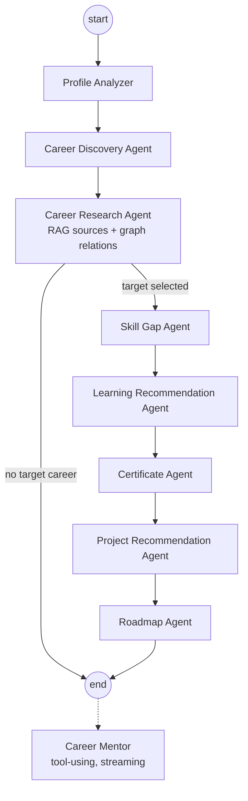
```mermaid
flowchart TD
  S((start)) --> PA[Profile Analyzer]
  PA --> CD[Career Discovery Agent]
  CD --> CR[Career Research Agent<br/>RAG sources + graph relations]
  CR -- no target career --> E((end))
  CR -- target selected --> SG[Skill Gap Agent]
  SG --> LR[Learning Recommendation Agent]
  LR --> CA[Certificate Agent]
  CA --> PR[Project Recommendation Agent]
  PR --> RM[Roadmap Agent]
  RM --> E
  E -.-> M[Career Mentor<br/>tool-using, streaming]
```

- Every agent runs a **deterministic engine first**, so results are reproducible and testable.
- When an LLM is configured, agents may *enrich* explanations through **Pydantic structured outputs** (`app/ai/schemas.py`). These pass through **guards** (`app/ai/guards.py`): unknown IDs are dropped, text is length-bounded, and forbidden claims ("guaranteed job", "best career for you") are rejected.
- **Agents never write to the database.** The service layer persists validated results only.
- Each response carries a `trace` (agent name + milliseconds), which the Discover page shows.
- The mentor is a tool router. Tools are the only way it can change user data (re-time roadmap, mark known, switch career, record quiz evidence).

## Recommendation engine

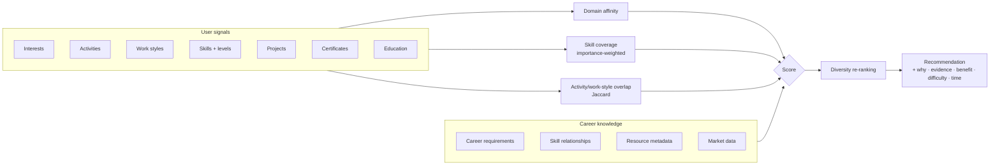
```mermaid
flowchart LR
  subgraph User["User signals"]
    I[Interests] & A[Activities] & W[Work styles] & SK[Skills + levels] & P[Projects] & C[Certificates] & E[Education]
  end
  subgraph Knowledge["Career knowledge"]
    R[Career requirements] & G[Skill relationships] & M[Resource metadata] & J[Market data]
  end
  User --> AFF[Domain affinity] --> SC{Score}
  User --> COV[Skill coverage<br/>importance-weighted] --> SC
  User --> ACT[Activity/work-style overlap<br/>Jaccard] --> SC
  Knowledge --> SC
  SC --> DIV[Diversity re-ranking] --> OUT[Recommendation<br/>+ why · evidence · benefit · difficulty · time]
```

- **Career score** = 0.45 × interest fit + 0.20 × activity fit + 0.35 × skill fit. Explicitly chosen interests are weighted up. A diversity re-rank keeps the paths genuinely different from each other. The score is used only for ordering; the UI shows reasons and a qualitative label, never a number.
- **Evidence model**: each skill has a stated level plus evidence (project, certificate, completed roadmap step, assessment). Readiness buckets show the *strength* of that evidence, including an explicit note when a skill is only self-reported.
- **Certificates** are scored by the gaps they cover, minus overlap with skills you already demonstrate, with a small bonus for proctored exams and a penalty for professional-level credentials early in a career. At most three are shown.
- **Projects** are scored by gaps covered, strengths reused, career relevance and domain interest (template *flavours*, e.g. a finance edition of the RAG assistant).
- **Roadmap**: career-specific phase skeletons. Skills already at target are skipped; partial skills start at the current level; missing prerequisites are inserted in topological order; hours scale by `hours_per_week`. The final phase is a portfolio flagship project.

## Career knowledge graph

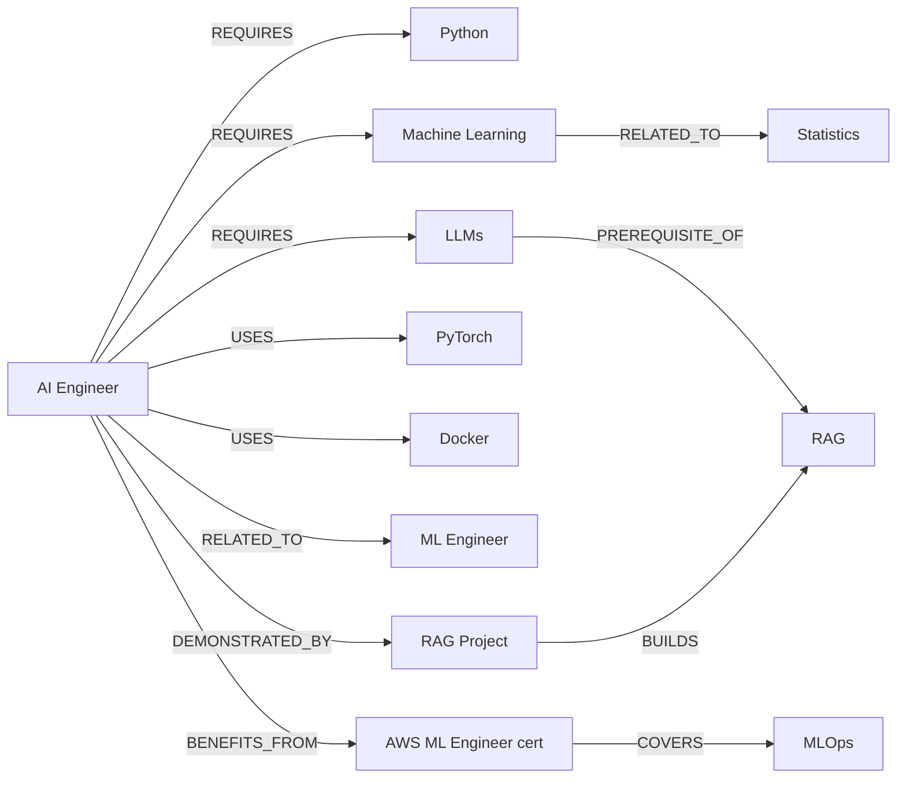
```mermaid
graph LR
  AI[AI Engineer] -- REQUIRES --> PY[Python]
  AI -- REQUIRES --> ML[Machine Learning]
  AI -- REQUIRES --> LLM[LLMs]
  AI -- USES --> PT[PyTorch]
  AI -- USES --> DK[Docker]
  AI -- RELATED_TO --> MLE[ML Engineer]
  AI -- DEMONSTRATED_BY --> RAGP[RAG Project]
  AI -- BENEFITS_FROM --> AWS[AWS ML Engineer cert]
  LLM -- PREREQUISITE_OF --> RAG[RAG]
  ML -- RELATED_TO --> STAT[Statistics]
  AWS -- COVERS --> MLOPS[MLOps]
  RAGP -- BUILDS --> RAG
```

The graph is synced from the YAML knowledge base on startup (`MERGE`, idempotent). Skill `RELATED_TO` edges come from co-requirement across careers. `GET /api/v1/graph/careers/{id}` feeds the React Flow visualisation.

## RAG pipeline

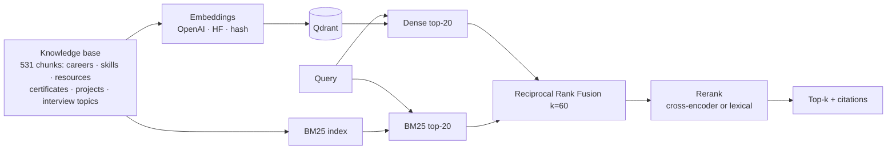
```mermaid
flowchart LR
  KB[Knowledge base<br/>531 chunks: careers · skills · resources<br/>certificates · projects · interview topics] --> EMB[Embeddings<br/>OpenAI · HF · hash]
  EMB --> QD[(Qdrant)]
  KB --> BM[BM25 index]
  Q[Query] --> D[Dense top-20] & S[BM25 top-20]
  QD --> D
  BM --> S
  D & S --> RRF[Reciprocal Rank Fusion k=60]
  RRF --> RR[Rerank<br/>cross-encoder or lexical]
  RR --> TOP[Top-k + citations]
```

Every chunk carries a citation (title, type, source, URL). The mentor numbers its sources `[n]` and labels them *"from the PathFinder knowledge base"*, which keeps them separate from what the user told us.

## Database design

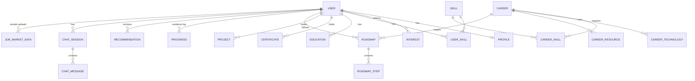
```mermaid
erDiagram
  USER ||--o| PROFILE : has
  USER ||--o{ INTEREST : selects
  USER ||--o{ USER_SKILL : has
  USER ||--o{ EDUCATION : has
  USER ||--o{ CERTIFICATE : holds
  USER ||--o{ PROJECT : builds
  USER ||--o{ ROADMAP : follows
  USER ||--o{ PROGRESS : "evidence log"
  USER ||--o{ RECOMMENDATION : receives
  USER ||--o{ CHAT_SESSION : has
  CHAT_SESSION ||--o{ CHAT_MESSAGE : contains
  ROADMAP ||--o{ ROADMAP_STEP : contains
  SKILL ||--o{ USER_SKILL : ""
  CAREER ||--o{ CAREER_SKILL : requires
  SKILL ||--o{ CAREER_SKILL : ""
  CAREER ||--o{ CAREER_TECHNOLOGY : uses
  CAREER ||--o{ CAREER_RESOURCE : ""
  CAREER ||--o{ ROADMAP : targets
  USER ||--o{ JOB_MARKET_DATA : "private uploads"
```

The models live in `backend/app/db/models.py`, with indexes on user foreign keys, `(user_id, status)` for roadmaps, `(roadmap_id, phase, order)` for steps, `(career_id, country, remote)` for job data, and unique constraints on user skills and interests.

**Adding a career needs no code change.** Add an entry to `backend/data/careers/*.yaml` and restart. Integrity checks on skills, related careers, certificates and projects fail loudly at startup, and the catalog tables, RAG index and graph re-sync automatically.

## API documentation

Interactive OpenAPI docs are served at **`/api/v1/docs`**.

| Method | Endpoint | Purpose |
|---|---|---|
| POST | `/auth/register` · `/auth/login` · `/auth/demo` · `/auth/logout` | Auth (JWT cookie + bearer) |
| GET | `/auth/me` · `/auth/oauth/google/login` | Session · OAuth |
| POST/GET/PATCH | `/profile` | Save onboarding · read · update |
| GET | `/profile/analysis` | Career profile visualisation |
| POST | `/skills` · `/interests` | Update skills / interests |
| POST | `/certificates` · `/certificates/upload` | Add / upload + analyse certificate |
| POST | `/projects` · `/projects/analyze` | Add project · preview analysis |
| GET | `/careers` · `/careers/{id}` · `/careers/categories` | Explorer (filter, search, paginate) |
| GET | `/graph/careers/{id}` · `/graph/skills/{id}` | Knowledge graph |
| POST | `/career/discover` · `/career/compare` · `/career/select` | Discovery · compare ≤4 · choose target |
| GET | `/gap-analysis` · `/readiness` | Gap analysis · evidence-based readiness |
| POST/GET | `/recommendations` | Certificates, projects, learning |
| POST/GET | `/roadmap/generate` · `/roadmap` | Generate · read |
| PATCH/POST | `/roadmap/steps/{id}` · `/roadmap/adjust` | Complete/skip · hours & known skills |
| GET | `/learning` · `/progress` · `/dashboard` | Learning plan · progress · home |
| POST | `/mentor/chat` | **SSE** streaming mentor (`meta`, `token`, `done`, `error`) |
| POST | `/interview/start` · `/interview/answer` | Interview mode |
| GET/POST | `/market/options` · `/market/analyze` · `/market/ingest` | Job-market intelligence |
| GET | `/search?q=` | Hybrid RAG search |
| GET/DELETE | `/account/export` · `/account` | Privacy: export · delete |
| GET | `/health` · `/system/status` · `/tasks/{id}` | Ops |

Errors always use the same envelope: `{"error": {"code": "...", "message": "...", "details": {...}}}`.

---

## Setup

**Prerequisites:** Python 3.11+ and Node 20+ (or just Docker).

```bash
# 1. Backend
cd backend
python -m venv .venv && source .venv/bin/activate
pip install -r requirements-dev.txt
cp ../.env.example ../.env            # optional: add OPENAI_API_KEY or GEMINI_API_KEY
uvicorn app.main:app --reload --port 8000

# 2. Frontend (new terminal)
cd frontend
npm install
npm run dev                           # http://localhost:3000
```

On first start the backend creates tables, syncs the knowledge base, seeds the **demo user**, generates a clearly labelled synthetic job-market sample and warms the RAG index and graph. Click **"Try the demo profile"** to see the example user from the spec (AI + Technology + Finance; Python, SQL, Java; ML, RAG; fraud-detection and RAG-chatbot projects) with an AI Engineer roadmap already in progress.

## Environment variables

See [`.env.example`](.env.example) for the full, commented list. Key ones:

| Variable | Default | Notes |
|---|---|---|
| `SECRET_KEY` | dev value | **Set in production** |
| `ENCRYPTION_KEY` | derived | Fernet key for uploads & chat |
| `DATABASE_URL` | SQLite | `postgresql+psycopg2://…` |
| `REDIS_URL` / `CELERY_BROKER_URL` / `CELERY_EAGER` | — / — / `true` | Cache, rate limits, background jobs |
| `QDRANT_URL`, `EMBEDDING_PROVIDER`, `RERANKER_MODEL` | embedded / `auto` / — | Retrieval |
| `NEO4J_URI`, `NEO4J_USER`, `NEO4J_PASSWORD` | in-memory | Knowledge graph |
| `LLM_PROVIDER`, `OPENAI_API_KEY`, `GEMINI_API_KEY` | `auto` | AI enrichment & mentor |
| `GOOGLE_CLIENT_ID/SECRET` | — | Optional OAuth |
| `OTEL_EXPORTER_OTLP_ENDPOINT`, `LANGSMITH_API_KEY` | — | Observability |
| `BACKEND_URL` (frontend) | `http://localhost:8000` | Proxy target for `/api/v1` |

## Docker

```bash
cp .env.example .env         # add an LLM key if you want AI-enriched text
docker compose up --build    # → http://localhost:3000   (API docs: :8000/api/v1/docs)
```

Services: `postgres`, `redis`, `qdrant`, `neo4j`, `api` (FastAPI), `worker` (Celery) and `web` (Next.js standalone). They include health checks, named volumes and run as non-root users.

---

## Testing

```bash
cd backend && python -m pytest          # 56 tests, fully offline (~12 s)
TEST_DATABASE_URL=postgresql+psycopg2://… TEST_REDIS_URL=redis://… python -m pytest tests/integration
cd frontend && npm run typecheck && npm run lint && npm run build
```

- **Unit** (`tests/unit`): catalog integrity, skill extraction, certificate/project/JD analysis, career matching, diversity, gap thresholds, certificate logic, project ladder, roadmap (skips known skills, partial levels, prerequisite ordering, hour scaling, valid-skill guarantee), readiness, RRF, embeddings, guards, interview rubric, mentor intent routing and the LangGraph pipeline.
- **Integration** (`tests/integration`): the full journey *Profile → Discovery → Selection → Gap → Roadmap → Step completion → Hours change → "I already know Docker" → Career switch with carry-over*. Also covers SSE mentor streaming with roadmap adaptation and quizzes, interview mode, market ingestion privacy, **cross-user isolation**, validation errors (no stack traces), secure uploads, export/delete and the demo account.
- **Verified here** against SQLite *and* PostgreSQL 16 + Redis 7, plus a real Celery worker (non-eager). An end-to-end Playwright run produced the screenshots.

## Evaluation

`tests/eval/test_ai_evaluation.py` runs labelled personas (AI builder, finance analyst, security-curious, designer, health data, founder, marketer):

| Metric | Method | Current |
|---|---|---|
| Recommendation relevance | Hit@3 and Precision@5 against labelled relevant careers | Hit@3 = 1.00 · P@5 = 0.51 |
| Explanation quality | Every reason traceable to user-provided data; ≥2 reasons per path | 100 % |
| Hallucination rate | Roadmap/project items outside KB or career requirements (+ prerequisites) | 0 % (301 items) |
| Citation correctness | Recall@5 of the expected KB document; all citations resolve | 1.00 |
| Career–resource relevance | Resources attached to each step belong to that step's skill | 100 % |
| Forbidden claims | No "guaranteed job", "best career", etc. | 0 |

With `LLM_PROVIDER` set, the same suite checks AI-enriched output, and LangSmith tracing can be turned on with `LANGSMITH_API_KEY`.

---

## Product principles

PathFinder **does not**: name one "best" career, claim to determine personality, guarantee jobs or salaries, claim certificates guarantee jobs, invent requirements, recommend resources without reasons, or overwhelm you (at most 6 paths, 3 certificates and 3 projects at a time).

PathFinder **does**: present several relevant paths, explain why each appeared, let you explore and decide, label *your data* separately from *knowledge-base information*, show the evidence behind every recommendation, and adapt as your profile changes.

> **Data honesty.** The bundled job-market sample is **synthetic** and labelled as such everywhere it appears. Paste real job descriptions (Job market → *Analyse your own job posts*) to analyse your actual market. Certificate prep-time ranges are rough typical ranges; always check the official page.

## Future improvements

- Alembic migrations (tables are currently created by `create_all` on startup)
- Licensed job-market connectors (e.g. job-board APIs) with scheduled Celery ingestion
- Fine-grained skill assessments (auto-graded coding and SQL exercises) as a stronger evidence type
- Vision-LLM certificate reading (OCR is optional today via Tesseract)
- Multilingual UI and region-specific career data
- Mentor memory summaries across sessions; calendar-aware weekly plans
- Admin UI for curating the knowledge base with review workflows
